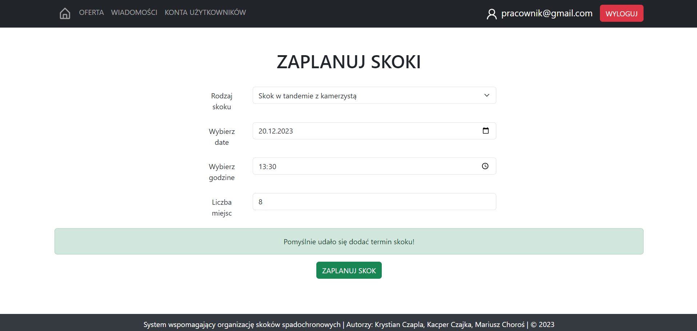

# System wspomagający organizację skoków spadochronowych
Niniejsza praca inżynierska przedstawia aplikację webową, która posiada pełen zestaw funkcjonalności wspierających organizację skoków spadochronowych. System ten ma na celu ułatwienie możliwości skorzystania z usług dla klientów, usprawnienie wykonywania pracy dla obsługi klienta oraz administratorów.

Wykorzystane technologie: React, Express, Node.js, MySQL

### Uruchomienie projektu
Aby uruchomić lolanie aplikację, należy:
1. Sklonować repozytorium
2. Zaimportować bazę danych np. w phpmyadmin
3. Przejść do scieżki /frontend oraz /backend, a następnie zainsalować niezbędne zależności:
    ```
    npm i
    ```
4. Uruchomić (odpowienio klienta oraz serwer):
    ```
    npm start
    ```

# Funkcjonalności aplikacji
#### Funkcjonalności niezalogowanego użytkownika:
- możliwość rejestracji,
- możliwość sprawdzenia aktualnej oferty firmy,
- możliwość sprawdzenia wolnych terminów na skoki spadochronowe,
- możliwość zalogowania.


#### Funkcjonalności zalogowanego użytkownika (klienta):
- możliwość rezerwacji terminu, poprzez wypełnienie formularza: (wybranie wolnego terminu oraz godziny, wybranie rodzaju skoku, wprowadzenie masy ciała, wybranie sposobu płatności)
- podgląd, edycja lub rezygnacja z zarezerwowanych terminów,
- podgląd, edycja własnych danych osobowych,
- możliwość wysyłania wiadomości,
- możliwość wylogowania,
- usunięcie konta.


#### Funkcjonalności pracownika:
- odpowiadanie na pytania
- planowanie terminów skoków,
- potwierdzenie dokonania płatności,
- zarządzanie ofertą (dodawanie, modyfikowanie, usuwanie)
- planowanie grafiku zarezerwowanych skoków,
- odwoływanie skoków oraz rozesłanie informacji klientom,
- zarządzanie danymi klientów (zakładanie kont klientów, ewidencjonowanie licencji klientów)


#### Funkcjonalności administratora:
- możliwość przeglądu kont pracowników,
- możliwość podglądu podsumowania finansowego, 
- możliwość tworzenia kont użytkowników,
- możliwość zarządzania rolami użytkowników,
- możliwość edycji kont użytkowników,
- możliwość usuwania kont użytkowników,
- blokowanie kont/odblokowanie.

# Przykładowe ekrany prezentujące apliakcję
### Rejestracja do aplikacji


### Oferta - dostępne rodzaje skoków spadochronowych


### Przegląd i wybór terminu skoku


### Rezerwacja terminu skoku spadochronowego


### Szczegóły skoku


### Edycja terminu rezerwacji


### Podgląd i edycja danych użytkownika


### Zarządzanie ofertą skoków przez pracownika



